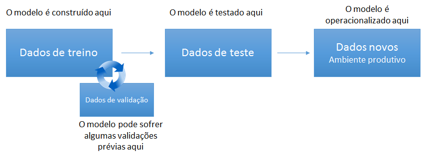
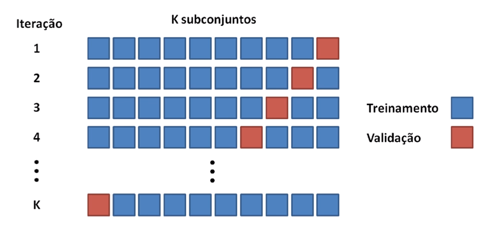

## **Validação e Reamostragem**

Quando estamos construindo um modelo estatístico ou de Aprendizado de Máquina necessitamos avaliar quão bom ele é, baseado em alguma métrica. Aditivamente, este teste de “qualidade” deve ser feito em dados que **não foram usados** na construção do modelo, assim poderemos inferir o comportamento do modelo em dados novos (que nunca foram vistos). Caso um modelo for testado com os dados de treino (os mesmos dados em que foi construído) não podemos generalizar seu resultado para o ambiente de produção, já que não sabemos qual será seu comportamento em dados nunca vistos. É por isso que existe o papel dos dados de teste.  

Durante o processo de treinamento do modelo, ainda é possível dividir os dados de treino em diferentes subconjuntos de dados. Chamamos estes subconjuntos de dados de validação e os utilizamos para fazer validações iniciais durante a aprendizagem do modelo.  

 

É importante garantir que os conjuntos de dados de treino, validação e teste contenham a mesma distribuição dos dados, ou seja, de nada adianta treinar/validar o modelo em um conjunto de dados que não representa o cenário real do problema em estudo. Chamamos de *reamostragem* toda essa organização dos conjuntos de dados. A seguir as formas de reamostragem abordadas neste aplicativo.

 
Exemplo sobre o papel dos conjuntos de Treino, Teste e Validação:
 

- Conjunto de treinamento: um conjunto de dados usados para aprendizado e para ajustar os parâmetros do classificador. No caso do Multilayer Perceptron (MLP), usaríamos o conjunto de treinamento para encontrar os pesos “ótimos” com a regra da retropropagação do erro.

- Conjunto de validação: um conjunto de dados usados para ajustar os parâmetros de um classificador. No caso do MLP, usaríamos o conjunto de validação para encontrar o número “ótimo” de neurônios nas camadas escondidas ou determinar um ponto de parada para o algoritmo da retropropagação do erro.

- Conjunto de testes: um conjunto de dados usados apenas para avaliar o desempenho de um classificador totalmente treinado. No caso MLP, usaríamos o teste para estimar a taxa de erro depois de termos escolhido o modelo final (número de camadas, neurônios e pesos). 

Por que separar conjuntos de teste e validação? A estimativa da taxa de erro do modelo final nos dados de validação será tendenciosa (menor que a taxa de erro real) já que o conjunto de validação é usado para selecionar o modelo final. Após avaliar o modelo final no conjunto de teste, VOCÊ NÃO DEVE continuar ajustando o modelo!

#### **Hold Out**

A divisão simples dos dados, ou hold out, envolve o particionamento dos dados em um conjunto de dados de treinamento e um conjunto de dados de teste (para alguns casos, também separa-se uma parte para validação) que é usado para avaliar o desempenho dos modelos em dados ainda não conhecidos.
Esta técnica é útil quando você possui um conjunto de dados grande o suficiente para que o conjunto de testes possa fornecer uma estimativa significativa de desempenho, ou seja, quando conseguimos comprovar que as amostras criadas têm significância estatística para representar a população, ou quando você estiver usando métodos lentos e precisar de uma rápida aproximação do desempenho.
Divisões comuns são: 80/75% dos dados destinados para treinamento e 20/25% para teste,  ou 70% para treinamento, 20% para validação e 10% para teste.  

 

#### **K-fold Validação Cruzada**
Na Validação Cruzada criam-se diferentes conjuntos de treino e teste para treinar o modelo e ter certeza de que ele está se comportando bem. Nesse caso, ao invés de usar apenas um conjunto de teste para validar o modelo, utiliza-se `N` outros a partir dos mesmos dados.
O método k-fold de Validação Cruzada irá dividir seu modelo `K` vezes. Por exemplo, o dataset é dividido em 10 partes (`k = 10`), para cada uma dessas partes, o modelo irá usar 9 partes (`K-1`) para treinar, enquanto usará 1 parte para validar. Ao final do processo, quando o modelo iterar/treinar 10 vezes, você terá um verdadeiro score de como seu modelo está generalizando, ao tirar a média e desvio padrão de todos os treinos realizados.  

 
#### **k-fold Validação Cruzada com Repetição**

O processo de dividir os dados na Validação Cruzada k-fold pode ser repetido em um determinado número de vezes, isto é chamado k-fold Validação Cruzada com Repetição. A precisão do modelo final é tomada como a média dos resultados de cada repetição.

#### **Bootstrap*

O método Bootstrap é uma técnica para fazer estimativas, tomando uma média dos resultados estimados de amostras de dados menores. Neste método são selecionadas amostras aleatórias dos dados (com substituição) repetidamente para avaliação do modelo.

**Note que para esta ferramenta, ao selecionar a opção `Padrão`, será implementado o método de reamostragem padrão do algoritmo (na maioria dos casos o Bootstrap), no pacote `caret`, que pode ser consultado na página `Sobre` desta aplicação.**  

 

Fonte e mais informações acesse [Hacking Analytics](https://hackinganalytics.com/2016/09/04/resampling-separando-os-dados-entre-treino-validacao-e-teste/)   
[Medium](https://medium.com/@eijaz/holdout-vs-cross-validation-in-machine-learning-7637112d3f8f)