## **Modelos Implementados**
Nesta ferramenta, existem 7 modelos diferentes para que você possa aplicá-los em seus problemas de Aprendizado de Máquina. Aqui, o objetivo é dar uma apresentação geral sobre cada um deles.  
Novamente, assim como destacado na página inicial, o intuito não é dar uma visão aprofundada, com todas as explicações matemáticas sobre todos os modelos, parâmetros e estatísticas, mas sim, fazer com que sua curiosidade seja despertada para pesquisar mais a fundo sobre todas as características.

- [Regressão Linear](#regressaolinear)
- [Árvore de Decisão](#arvorededecisao)
- [Floresta Aleatória](#florestaaleatoria)
- [K-Vizinhos Mais Próximos](#kvizinhosmaisproximos)
- [Máquina Vetor de Suporte](#maquinavetordesuporte)
- [Naive Bayes](#naivebayes)
- [Perceptron MultiCamadas](#perceptronmulticamadas)

 
###  **Regressão Linear**

Regressão linear é um modelo linear, ou seja, um modelo que assume uma relação linear entre as variáveis de entrada $x$  e a variável dependente de saída única $y$ .Mais especificamente, esse $y$ pode ser calculado a partir de uma combinação linear das variáveis independentes de entrada $x$.
 
Quando há uma única variável de entrada $x$, o método é referido como regressão linear simples.
 
Quando existem mais de uma variável de entrada, o método é conhecido como regressão linear múltipla.
 
 
#### **Regressão Linear Simples**

Na regressão linear simples, estabelecemos uma relação entre a variável alvo $y$ e as variáveis de entrada $x$ , ajustando uma linha entre os pontos no plano $(x,y)$, conhecida como linha de regressão.
 
Em geral, uma linha pode ser representada pela equação linear $y = m * X + b$. Onde $y$ é a variável dependente, $X$ é a variável independente, $m$ é a inclinação da reta, $b$ é a intercepção da reta com o eixo vertical.

No aprendizado de máquina, é comum reescrevermos nossa equação como:
 
$y(x) = W_{0} + W_{1} * x$
 
onde $W_{0}$ e $W_{1}$ são os parâmetros do modelo, $x$ é a entrada e $y$ é a variável alvo. Valores diferentes de $W_{0}$ e $W_{1}$ nos darão linhas diferentes.
 

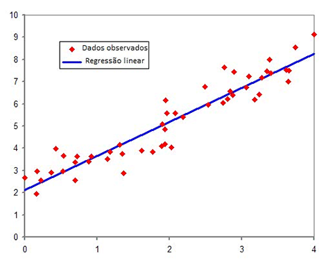

   

#### **Regressão Linear Múltipla**

A equação acima pode ser usada quando temos uma variável de entrada. No entanto, em geral, lidamos com conjuntos de dados que possuem várias variáveis de entrada. A equaçãp da regressão linear múltipla é dada por :  

$y(x) = W_{0} + W_{1}X_{1} + W_{2}X_{2} + W_{3}X_{3} + ... + W_{n}X_{n}$
 

No caso da regressão linear múltipla, teremos um hiperplano no espaço n-dimensional. Por exemplo, em 3D, nosso gráfico ficaria da seguinte forma:  

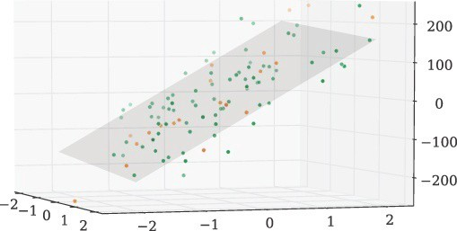

   

#### **Função Custo**

Diferentes valores dos pesos $(W_{0}, W_{1}, W_{2}, W_{3}, ... ,W_{n})$ nos dão ajustes diferentes, e nossa tarefa é encontrar pesos para os quais tenhamos o melhor posicionamento do hiperplano. Uma pergunta que você pode ter é: como podemos determinar quão bem uma determinada linha ou plano se ajusta aos nossos dados? Ou, dadas duas linhas, como determinamos qual é a melhor? Para isso, utilizamos uma função de custo que mede, dado um valor particular para os $W$, quão próximos os $Y_{s}$ estão de $y_{verdadeiros}$ correspondentes. Isto é, quão bem um determinado conjunto de pesos prediz o valor alvo. 
 
Para a regressão linear, usamos a função de custo chamada **erro quadrático médio**. É a média do erro quadrático entre o valor previsto $y(x)$ e o valor observado $y$. 
 
$J(W) = \frac{1}{n} \sum_{i = 1}^{n}(y(x^{i}) - y^{i}_{verdadeiro})²$
 
  
#### **Resíduos**
A função custo define um custo baseado na distância entre o alvo verdadeiro e o alvo previsto (mostrado no gráfico como linhas pretas entre pontos da amostra e a linha vermelha de regressão), o que é chamado de resíduos.
   

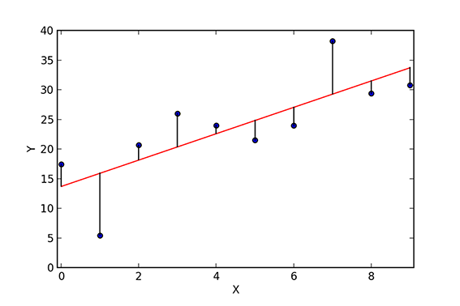

   

Se uma linha particular estiver longe de todos os pontos, os resíduos serão mais altos e a função custo também. Se uma linha estiver próxima dos pontos, os resíduos serão pequenos e, portanto, a função custo também será. 
 
O objetivo então, é minimizar essa função custo, o que chamamos de **otimização**, e  que geralmente é feito através do método do [Gradiente Descendente](https://matheusfacure.github.io/2017/02/20/MQO-Gradiente-Descendente/), o qual não entraremos em detalhes aqui. 

   

 

###  **Árvore de Decisão**
  

Árvores de decisão (*Decision Trees*) são um método de aprendizagem supervisionada usado para classificação e regressão. As árvores de decisão aprendem com os dados a partir de um conjunto de regras de decisão *if-then-else* (se-então-caso contrário). Quanto mais profunda a árvore, mais complexa é a decisão e mais apto o modelo, na maioria dos casos.
 
A árvore de decisão constrói modelos de classificação ou regressão na forma de uma estrutura em árvore. Ele divide um conjunto de dados em subconjuntos menores e menores e, ao mesmo tempo, uma árvore de decisão associada é desenvolvida de forma incremental. O resultado final é uma árvore com nós de decisão e nós de folha. Um nó de decisão possui dois ou mais ramos. O nó da folha representa uma classificação ou decisão. O nó de decisão mais alto em uma árvore que corresponde ao melhor preditor é chamado nó raiz. As árvores de decisão podem manipular dados categóricos e numéricos.
 
Para melhorar o entendimento sobre o algoritmo, vamos analisar alguns exemplos:
 
 

#### **Árvore de Decisão para Classificação**

Vamos considerar uma tarefa de classificação na qual você deve classificar um conjunto de dados de flores em três categorias diferentes, Setosa, Versicolor e Virginica, com base nos valores de alguns atributos. Nós usaremos o comprimento de sua pétala e a largura da pétala como atributos ou características de interesse.

 

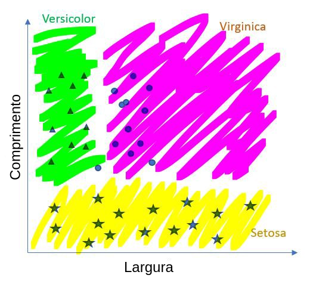

Podemos separar estas variedades de flores com duas linhas diferentes em 3 regiões quadradas. Podemos separar Setosa das outras duas com uma linha horizontal que corresponde ao comprimento = 2,45 cm. Uma flor com comprimento de pétala inferior a 2,45 cm é uma variedade Setosa. Acima desta linha seria um Versicolor ou um Virginica.

 

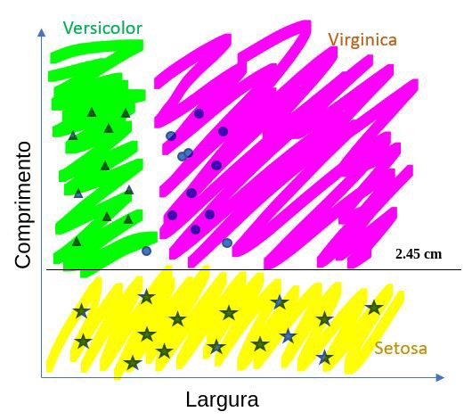

Vamos traçar outra linha para separar as outras duas variedades. Versicolor e Virginica podem ser separados por uma linha vertical correspondente à largura da pétala = 1,75 cm. Note que esta condição está no topo da condição anterior no comprimento da pétala.

 

Agora temos nossas linhas as quais dividem os dados em 3 partes diferentes. A árvore de decisão para isso se parece com:

 

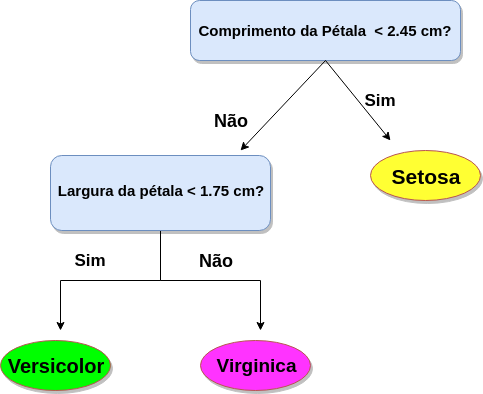

 
Agora, quando você ver uma nova flor, apenas meça o comprimento e a largura da sua pétala e analise sua árvore de decisão, e você pode determinar qual variedade de é essa. Por exemplo, uma flor que você encontrou em uma caminhada tinha comprimento de pétala de 2,48 cm e largura de pétala de 1,86 cm; sua árvore de decisão diz que é Virginica desde o comprimento da pétala> 2,45 cm e largura da pétala> 1,75 cm.  
As árvores de decisão são boas na classificação, mas elas também podem ser usadas para tarefas de regressão.
 
 
#### **Árvore de Decisão para Regressão**
A regressão funciona de forma semelhante à classificação nas árvores de decisão, escolhemos os valores para particionar nosso conjunto de dados, mas em vez de atribuir classe a uma região específica ou a uma área particionada, retornamos a média de todos os pontos de dados naquela região. O valor médio minimiza o erro de previsão em uma árvore de decisão.  
Na visualização gráfica abaixo, por exemplo, retornaríamos a média de todos os pontos de cada *Split*.

 

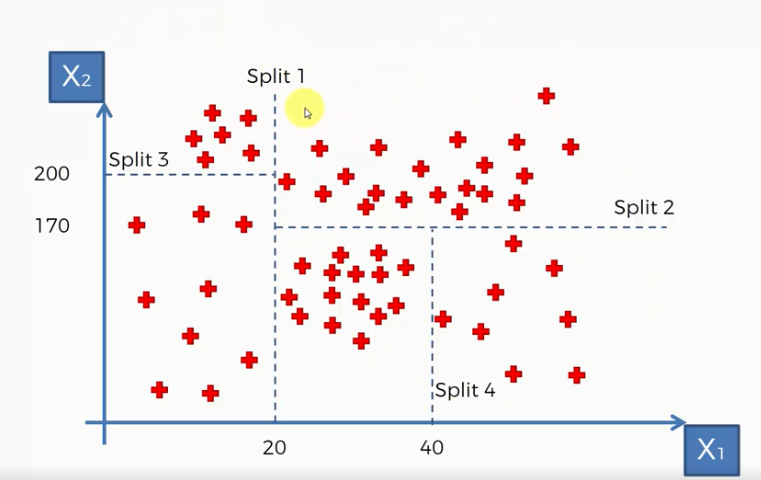

 

Fonte e mais informações acesse:  
[Medium - Savan Patel](https://medium.com/machine-learning-101/chapter-3-decision-trees-theory-e7398adac567)  
[Medium - Chirag Sehra](https://medium.com/@chiragsehra42/decision-trees-explained-easily-28f23241248)   
[Medium - Biraj Parikh](https://medium.com/greyatom/decision-tree-intuition-a38669005cb7)  
[Medium - Prateek Karkare](https://medium.com/x8-the-ai-community/decision-trees-an-intuitive-introduction-86c2b39c1a6c)  
 

###  **Floresta Aleatória**
 
Uma vez que o tópico sobre as Árvores de Decisão foi compreendido, ficará mais fácil entender sobre o algoritmo das Florestas Aleatórias. É recomendado então que primeiramente entenda o algoritmo de Árvores de Decisão ilustrado anteriormente.
 
Floresta Aleatória (*Random Forest*) é um algoritmo de aprendizagem supervisionada, que pode ser usado tanto para solucionar problemas de regressão quanto classificação. O nome do algoritmo é bastante sugestivo e explica muito sobre seu funcionamento.  
Esse algoritmo propõe criar várias pequenas árvores de decisão, todas com um desempenho inferior a uma única árvore maior, mas que unidas fazem a diferença. Geralmente são criadas 200, 500, ou mais árvores as quais geram resultados sobre o valor predito. Assim, a previsão final é um resumo desses resultados obtidos por cada árvore, geralmente a média entre elas, para casos de regressão, e a moda (valor que mais aparecer), para casos de classificação. 
 
De forma simplificada, o algoritmo cria uma 'floresta' aleatoriamente, composta por uma combinação de árvores de decisão, e toma como saída final a sumarização de cada resultado das árvores de decisão, dessa forma pode obter uma predição mais estável e com maior acurácia.  
 

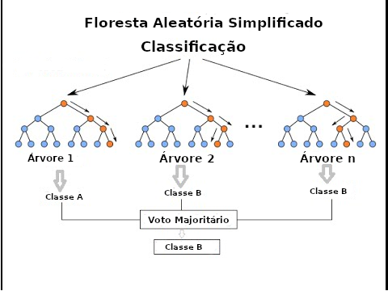 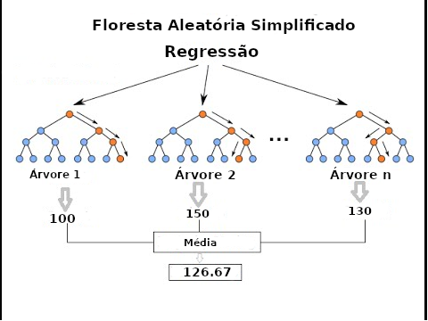

 
Fonte e mais informações acesse:  
[Medium Josenildo Costa](https://medium.com/machina-sapiens/o-algoritmo-da-floresta-aleat%C3%B3ria-3545f6babdf8)  
[Athos Petri Damiani](https://rstudio-pubs-static.s3.amazonaws.com/123284_bf5c001edce8407cbf893acaffe3eb3a.html)  
[KD Nuggets](https://www.kdnuggets.com/2019/01/random-forests-explained-intuitively.html)  
 

###  **K-Vizinhos Mais Próximos**
K-Vizinhos mais próximos (*K-Nearest Neighbor*), ou KNN,  é um algoritmo de aprendizado supervisionado utilizado para solucionar problemas tanto de classificação como regressão, porém, é muito mais utilizado para resolver problemas de classificação. Por esse motivo, iremos nos concentrar no seu funcionamento em problemas de classificação (o processo é muito similar quando comparado à solucionar problemas de regressão).  
O KNN utiliza a distância entre os pontos no espaço para decidir a que classe os novos dados pertencem. O algoritmo funciona da seguinte maneira:  
Imagine um conjunto de dados que possua duas classes, os quadrados azuis, e os losangos laranjas, como mostrado:
 

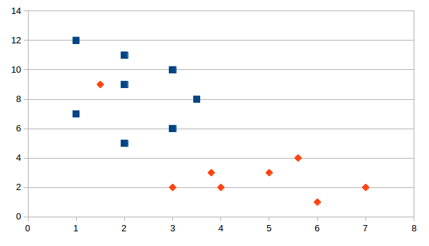

  
 
Agora, dado outro conjunto de pontos de dados (seja o conjunto de testes ou dados novos), o algoritmo terá que alocar esses pontos (triângulos amarelos) a um grupo já existente (quadrados ou losangos) analisando o conjunto de treinamento. Observe novamente que os pontos não classificados estão marcados como "amarelos".

 

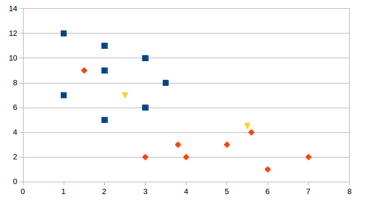

  
 
 Se traçarmos esses pontos em um gráfico, poderemos localizar alguns grupos, como na primeira imagem. Agora, dado um ponto não classificado, como na segunda imagem, podemos atribuí-lo a um grupo observando a que grupo seus vizinhos mais próximos pertencem. Isso significa que um ponto próximo a um grupo de pontos classificados como "Losangos Vermelho" tem uma probabilidade maior de ser classificado como "Losangos Vermelho". Intuitivamente, podemos ver que o primeiro ponto (2.5,7) deve ser classificado como "Quadrado Azul" e o segundo ponto (5.5, 4.5) deve ser classificado como "Losango Vermelho". 
  
 Acompanhando este exemplo, você conseguiu identificar as novas classes intuitivamente. O algoritmo, porém, utiliza a distância entre os novos pontos e os pontos já existentes no espaço para dizer a que grupo os novos pontos pertencem. O **K**, presente no nome **K-Vizinhos Mais Próximos**, representa o número de vizinhos que serão considerados.  
 
As distâncias que são usualmente utilizadas são as seguintes:  

- Euclidiana : $\sqrt{\sum_{i = 1}^{k} (x_{i} - y_{i} )^2}$  (Mais Utilizada) 
 

- Manhattan:  $\sum_{i = 1}^{k} |x_{i} - y_{i}|$  

- Minkowski: $(\sum_{i = 1}^{k} (|x_{i} - y_{i}|)^q)^\frac{1}{q}$  

Em suma:
 

1 - O algoritmo recebe um dado não classificado, ou seja, os dados do conjunto de teste, ou novos dados do usuário.   

2 - Mede a distância (Euclidiana, Manhattan, Minkowski ou Ponderada) do novo dado com todos os outros dados que já estão classificados;   

3 - Obtém as K menores distâncias ao redor do ponto.   

4 — Verifica a classe de cada da um dos dados que tiveram a menor distância e conta a quantidade de cada classe que aparece;   

5 - Toma como resultado a classe que mais apareceu dentre os dados que tiveram as menores distâncias.   

6 - Classifica o novo dado com a classe tomada como resultado da classificação   

 
Fonte e mais informações acesse:  
[Medium Ítalo José](https://medium.com/brasil-ai/knn-k-nearest-neighbors-1-e140c82e9c4e)  
[Medium Chirag Sehra](https://medium.com/@chiragsehra42/k-nearest-neighbors-explained-easily-c26706aa5c7f)  
[Analytics Vidhya](https://www.analyticsvidhya.com/blog/2018/03/introduction-k-neighbours-algorithm-clustering/)  
 

###  **Máquina Vetor de Suporte (SVM)**
Máquina Vetor de Suporte ( SVM - *Support Vector Machine*), é um algoritmo de aprendizado de máquina supervisionado que pode ser usado para resolver problemas de regressão e de classificação, sendo mais utilizado neste último, por isso vamos focar nessa aplicação.
 
Nesse algoritmo, o objetivo é plotar cada ponto de dados em um espaço n-dimensional, onde n é o números de atributos do seu conjunto de dados. A partir daí, a classificação é feita encontrando o hiperplano que separa melhor as classes no espaço.

  
 
 Vetores de Suporte são simplesmente as coordenadas da observação individual. Máquina Vetor de Suporte é uma fronteira que melhor segrega as duas ou mais classes (hiperplano / linha). Portanto, o objetivo é encontrar a melhor fronteira, ou o melhor hiperplano, que separa as classes no espaço. Observe a imagem abaixo, como identificar o melhor hiperplano?
 
 

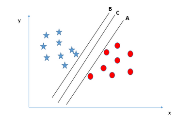

  
 
Aqui, maximizar as distâncias entre o ponto de dados mais próximo (de qualquer classe) e o hiperplano nos ajudará a decidir o hiperplano correto. Essa distância é chamada de Margem.

 

  
 
Acima, você pode perceber que a margem para o hiperplano C é alta quando comparada a ambos, A e B. Assim, nomeamos o hiperplano mais adequado como o hiperplano C. Outra razão para selecionar o hiperplano com maior margem é a robustez. Se selecionarmos um hiperplano com baixa margem, haverá uma alta chance de sejam feitas classificações equivocadas. 
 
Porém, devemos nos atentar a um fato, a Máquina Vetor de Suporte seleciona o hiperplano que classifica as classes com maior precisão antes de selecionar aquele que possui a maior margem. Na imagem abaixo, o hiperplano B tem um erro de classificação, apesar de possuir a maior margem, por outro lado A classificou tudo corretamente. Portanto, o hiperplano correto para o algoritmo é A:

 

A máquina vetor de suporte tem um recurso para ignorar valores discrepantes (*outliers*) e encontrar o hiperplano que tem margem máxima. Portanto, podemos dizer que o algoritmo é robusto para outliers. Como por exemplo, na imagem abaixo, o algoritmo identifica o ponto discrepante e encontra o melhor hiperplano sem sofrer influência deste valor.
  

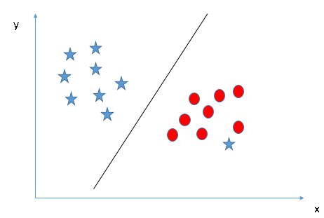

 

Em caso de encontrarmos um conjunto onde as classes no plano não são linearmente separáveis, como os exemplos citados acima, o algoritmo tem uma técnica chamada truque do kernel (*kernel trick*), as quais são funções que transformam um espaço de entrada dimensional baixo em um espaço dimensional superior, isto é, ele converte um problema não separável em um problema separável. Essas funções são chamadas de *kernels*. É principalmente útil no problema de separação não linear. Simplificando, ele faz algumas transformações de dados e, em seguida, descobre o processo para separar os dados com base nas classes ou nas saídas que você definiu. 
 
Tome como exemplo as imagens abaixo, o algoritmo resolve esse problema introduzindo um atributo adicional. Aqui, vamos adicionar um novo atributo $z = x ^ 2 + y ^ 2$. Agora, vamos plotar os pontos de dados nos eixos x e z:
 

  

  

 

 
Fonte e mais informações acesse:  
[Analytics Vidhya 1](https://www.analyticsvidhya.com/blog/2014/10/support-vector-machine-simplified/?utm_source=blog&utm_medium=understandingsupportvectormachinearticle)  
[Medium Zach Bedell](https://medium.com/@zachary.bedell/support-vector-machines-explained-73f4ec363f13)  
[Analytics Vidhya 2](https://www.analyticsvidhya.com/blog/2017/09/understaing-support-vector-machine-example-code/)  
 

###  **Naive Bayes**
Um classificador Naive Bayes é um modelo probabilístico de aprendizado de máquina usado para tarefas de classificação. O cerne do classificador é baseado no teorema de Bayes.
 
Não é um algoritmo único, mas uma família de algoritmos que compartilham um princípio comum, de que cada característica sendo classificada é independente do valor de qualquer outra característica. Assim, por exemplo, uma fruta pode ser considerada uma maçã se for vermelha, redonda e com cerca de 6 cm de diâmetro. Um classificador Naive Bayes considera que cada uma dessas “características” (vermelhas, redondas, de 6 cm de diâmetro) contribui independentemente para a probabilidade de que a fruta seja uma maçã, independentemente de quaisquer correlações entre as características. As características, no entanto, nem sempre são independentes, o que geralmente é visto como uma falha do algoritmo Naive Bayes e é por isso que ele é rotulado como "ingênuo" (*naive*).
 
Embora seja uma ideia relativamente simples, o Naive Bayes muitas vezes pode superar outros algoritmos mais sofisticados e é extremamente útil em aplicativos comuns como detecção de spam e classificação de documentos. Em suma, o algoritmo nos permite prever uma classe, dado um conjunto de características usando probabilidade. Assim, em outro exemplo de frutas, poderíamos prever se uma fruta é uma maçã, laranja ou banana (classe) com base em sua cor, forma, etc.

- **Teorema de Bayes**:  $P(A|B) = \frac{P(B|A)P(A)}{P(B)}$ 
 

Usando o teorema de Bayes, podemos encontrar a probabilidade de A acontecer, dado que B ocorreu. Aqui, B é a evidência e A é a hipótese. Novamente, a suposição feita aqui é que os preditores / características são independentes, isto é, a presença de uma característica específica não afeta a outra. 
 

**Tipos de Classificador Naive Bayes:**  
 
- **Naive Bayes Multinomial**:  
é usado principalmente para problemas de classificação de documentos, ou seja, se um documento pertence à categoria de esportes, política, tecnologia, etc. Os preditores usados pelo classificador são a frequência das palavras presentes no documento.
 
- **Bernoulli Naive Bayes**:  
É semelhante aos Naive Bayes multinomiais, mas os preditores são variáveis booleana. Os parâmetros que usamos para prever a variável de classe ocupam apenas valores sim ou não, por exemplo, se uma palavra ocorre no texto ou não. 
 
- **Naive Bayes Gaussiano**:  
Quando os preditores tomam um valor contínuo e não são discretos, assumimos que esses valores são amostrados a partir de uma distribuição gaussiana.
 
 
 
Conclusão: Os algoritmos Naive Bayes são usados principalmente em aplicações que envolvem análise de sentimento, filtragem de spam, sistemas de recomendação, etc. Eles são rápidos e fáceis de implementar, mas sua maior desvantagem é que o requisito de preditores seja independente. Na maioria dos casos reais, os preditores são dependentes, o que dificulta o desempenho do classificador.

 
Fonte e mais informações acesse:  
[Towards Data Science 1](https://towardsdatascience.com/all-about-naive-bayes-8e13cef044cf)  
[Towards Data Science 2](https://towardsdatascience.com/naive-bayes-classifier-81d512f50a7c)  
[Analytics Vidhya](https://www.analyticsvidhya.com/blog/2017/09/naive-bayes-explained/)  
 

###  **Perceptron Multicamadas**

Inspirando-se no funcionamento dos neurônios biológicos do sistema nervoso dos animais, estabeleceu-se na área da Inteligência Artificial um modelo computacional de um neurônio, que compõe as redes neurais, conforme ilustrado a seguir:
 

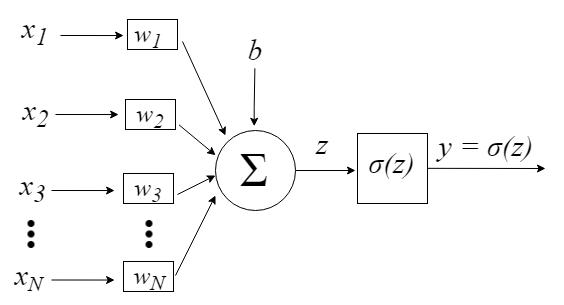

 

Os sinais da entrada no neurônio são representados pelo vetor $x = [x_{1}, x_{2}, x_{3}, …, x_{N}]$, podendo corresponder aos pixels de uma imagem, por exemplo. Ao chegarem ao neurônio, são multiplicados pelos respectivos pesos sinápticos, que são os elementos do vetor $w = [w_{1}, w_{2}, w_{3}, …, w_{N}]$, gerando o valor z, comumente denominado potencial de ativação, de acordo com a expressão: 
 
$z = \sum_{i = 1}^{N}x_{i}w_{i} + b$.
 
O termo adicional b provê um grau de liberdade a mais, que não é afetado pela entrada nessa expressão, correspondendo tipicamente ao “bias” (viés).

Com apenas um neurônio não se pode fazer muita coisa, mas podemos combiná-los em uma estrutura em camadas, cada uma com número diferente de neurônios. O Perceptron Multicamadas (PMC ou *MLP - Multi Layer Perceptron*) é uma rede neural, com uma ou mais camadas escondidas com um número ajustável de neurônios. A camada escondida possui esse nome porque não é possível prever a saída desejada nas camadas intermediárias.

 

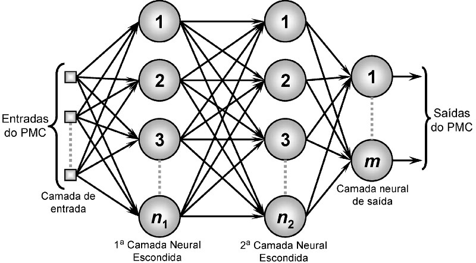

 

O treinamento de uma rede MLP insere-se no contexto de aprendizado de máquina supervisionado, em que cada amostra de dados utilizada apresenta um rótulo informando a que classificação ela se encaixa. Por exemplo, uma imagem de um cachorro contém um rótulo informando que aquilo é um cachorro. Assim, o objetivo é fazer com que a rede aprenda os padrões referentes a cada cada classe. A partir daí, quando uma amostra desconhecida for fornecida à rede, ela seja capaz de estabelecer a qual classe tal amostra pertence. 
 

Existem métodos para se treinar um Perceptron Multicamadas, e um deles comumente utilizado é a Retropropagação do Erro (*Error Backpropagation*).  

O Perceptron Multicamadas é utilizado tanto em problemas de classificação como em problemas de regressão (principalmente não lineares).
 
É realmente aconselhável navegar pelas referências e fontes aqui citadas caso você queira se aprofundar e entender mais sobre o algoritmo.

 
Fonte e mais informações acesse:  
[Medium Ensina Aí - Tiago M. Leite](https://medium.com/ensina-ai/redes-neurais-perceptron-multicamadas-e-o-algoritmo-backpropagation-eaf89778f5b8)  
[Medium Ensina Aí - Sandro Moreira](https://medium.com/ensina-ai/rede-neural-perceptron-multicamadas-f9de8471f1a9)  
[Medium - Prateek Karkare](https://medium.com/datadriveninvestor/neural-networks-an-intuition-640821d5bd83)  
 

