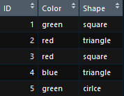
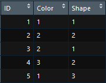
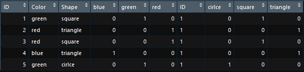

Algoritmos de aprendizado de máquina aprendem com dados, por isso é fundamental que você forneça os dados corretos para o problema que deseja resolver para que se possam obter os melhores resultados do modelo aplicado. Mesmo se você tiver bons dados, você precisa se certificar de que eles estão, por exemplo, em uma escala e formatos corretos. Alguns modelos de Aprendizado de Máquina precisam de dados em um formato específico, por exemplo, o algoritmo de Floresta Aleatória não suporta valores nulos; portanto, para executá-lo, é necessário tratar os conjuntos de dados brutos originais.  
Existem diversas técnicas de pré-processamento de dados que podem ser aplicadas no seu conjunto de dados. Nesta página, abordaremos algumas das principais delas.  

### **Escalonamento de Atributos (*Feature Scaling*)** 

É o método para limitar o intervalo de variáveis para que elas possam ser comparadas em bases comuns. É realizado em variáveis contínuas.  
Na maioria das vezes, seu conjunto de dados conterá atributos altamente variados em magnitude, unidades e alcance, como por exemplo:
   
 + número de quartos (1 a 3)  
 + Área (50 a 150 m²)  
 + Preço (150.000 a 600.000 US$) 
  
 
Se tentarmos aplicar métodos baseados em distância, como K-Vizinhos Mais Próximos, nesses atributos, o atributo com o maior intervalo dominará os resultados e obteremos previsões menos precisas. Para suprimir esse efeito, precisamos trazer todos os atributos para o mesmo nível de magnitude, o que pode ser feito usando o escalonamento de Atributos.  

Existem três métodos comuns para executar o escalonamento de atributos:  

 - **Padronização**: A padronização substitui os valores por seus *score-Z*, e isso redistribui as características com sua média $μ = 0$ e desvio padrão $σ = 1$:  
 
 $x' = \frac {x - \overline{x}}{σ}$
 
  
 Onde : 
  
 $x$ = valor antigo
  
 $\overline{x}$ = média de todos valores da coluna
  
 $σ$ = desvio padrão da coluna
  
 - **Normalização pela Média**: Esta distribuição terá valores entre -1 e 1 com $μ = 0$.  
 
 $x' = \frac {x - média(x)}{max(x) - min(x)}$
 
  
 
 - **Escalonamento Máximo-Mínimo** : Essa escala traz o valor entre 0 e 1.  
 
 $x' = \frac {x -min(x)}{max(x) - min(x)}$
 
  
  
 
### **Tratamento de Variáveis Categóricas**

Em projetos de aprendizado de máquina, é muito comum ver atributos categóricos em um conjunto de dados ( Gênero seria um exemplo de uma variável categórica, com as duas classes ou grupos: masculino e feminino). No entanto, em particular, muitos algoritmos de aprendizado de máquina exigem que sua entrada seja numérica e, portanto, os atributos categóricos devem ser transformados em atributos numéricos antes de podermos usar qualquer um desses algoritmos. É essencial codificar atributos categóricos em valores numéricos.  
Existem algumas técnicas de codificação de atributos categóricos, e existem algumas técnicas mais comuns.  
Considere a tabela abaixo, e as duas colunas categóricas *Color* e *Shape*:

 

 

- **Label Encoding ou Integer Encoding** : Converte cada valor de string em um número inteiro. O primeiro valor único em sua coluna se torna 1, o segundo se torna 2, o terceiro se torna 3 e assim por diante. 
 

Aplicando-se o Label Encoding na tabela acima, temos:

 

 

- **Codificador OneHot** : 
O codificador one-hot cria uma coluna para cada valor para comparar com todos os outros valores. Para cada nova coluna, uma linha recebe 1 se a linha continha o valor dessa coluna e 0, se não continha.

  
 Aplicando-se o Codificador OneHot na tabela inicial, as categorias se transformaram em colunas (variáveis) onde o número 1 representa o valor afirmativo e o 0 negativo:
  
 
 

 

 
 
### **Valores Ausentes** :

Valores ausentes estão presentes nos dados do mundo real. Podem haver várias razões pelas quais eles ocorrem - desde erros humanos durante a inserção de dados em um sistema, leituras incorretas de sensores, até erros de software no fluxo de processamento de dados. Porém, é importante que eles sejam tratados, visto que alguns algoritmos não suportam valores ausentes como entrada. Existem algumas técnicas para lidar com valores ausentes. 
 

- **Remoção dos Valores** : É a técnica mais simples, consiste em simplesmente remover as observações que possuem valores ausentes. É recomendado quando existem poucos valores ausentes no seu conjunto de dados, algo abaixo de 10%.
 

- **Imputação da Média / Mediana / Moda**
Nesse método, quaisquer valores ausentes em uma determinada coluna são substituídos pela média (ou mediana ou moda) dessa coluna. É também fácil de implementar e compreender.
 

- **Adicionar um novo atributo**
Adicionando um novo atributo *nulo*  indica quais linhas têm valores ausentes para este atributo. Ao fazer isso, os métodos baseados em árvore agora podem entender que havia um valor ausente. A desvantagem é que dobramos o número de recursos.

 

Existem também técnicas mais avançadas, que fogem do escopo dessa ferramenta, mas que podem ser consultadas nas referências.
 

### **Machine Learning Toolkit e Pré-processamento**
No Machine Learning Toolkit, as técnicas de pré-processamento são aplicadas tanto nos conjuntos de treino e teste, e nos novos dados para realizar as predições e as classificações. Tudo isso é feito através das funções de pré-processamento do pacote `caret`, que podem ser consultadas em sua documentação oficial.  
 

- **Todas as variáveis categóricas são automaticamente codificadas para numéricas.**
 
- **Nos algoritmos Máquina Vetor de Suporte, Regressão Linear, K-Vizinhos Mais Próximos e Perceptron Multicamadas, os dados sofrem escalonamento de atributos através de padronização.**
 
- **A ferramenta NÃO suporta valores ausentes. TODAS AS LINHAS que contém valores ausentes são excluídas do conjunto de dados.**  

 
Fontes e mais informações acesse:  
[Towards Data Science 1](https://towardsdatascience.com/working-with-missing-data-in-machine-learning-9c0a430df4ce)  
[Towards Data Science 2](https://towardsdatascience.com/handling-missing-values-in-machine-learning-part-1-dda69d4f88ca)  
[Acquia](https://dev.acquia.com/blog/how-to-handle-missing-data-in-machine-learning-5-techniques/09/07/2018/19651)  
[Machine Learning Mastery](https://machinelearningmastery.com/how-to-prepare-data-for-machine-learning/)  
[Medium 1](https://medium.com/hugo-ferreiras-blog/dealing-with-categorical-features-in-machine-learning-1bb70f07262d)  
[Medium 2](https://medium.com/greyatom/why-how-and-when-to-scale-your-features-4b30ab09db5e)
[Medium 3](https://medium.com/@arthurlambletvaz/one-hot-encoding-o-que-%C3%A9-cd2e8d302ae0)
 

